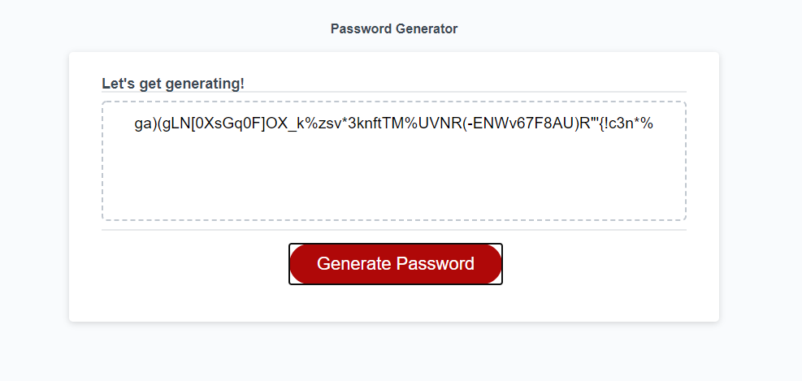

# Password Generator Application

## Project Overview
Password Generator 1.0 builout. Developer leveraged JavaScript to build out logic that fires button event and generates password through function call. generatePassword function leverages window.prompts and window.confirms to collect user input and parameters to determine length and content of password. Multiple if/else statements evalute user input for password length to ensure value is not null, then if value is number, and then if number is in specified 8-128 range. 

After confirmation, generatePassword initializes characterLibrary object of character combinations and assigns all possible combinations to variables as single-value arrays. Variables are then passed into characterArray to house for later use as arguments to passwordIterator calls. 

Once window.confirms determine parameters of password, multiple if/else statements are used to match user preferences to correct character combination, at which point passwordIterator is called with corresponding index value of characterArray. passwordIterator generates a random number based off length of characterArray nested array and then accesses the value of the nested array at that index. This value is converted to a string and concatenated onto finishedString variable. passwordIterator continues this operation until length of finishedString matches user's specified length for password. finishedString is then returned as value of generatePassword, which is then written out to the index.html file by writePassword function.

## Live Application
https://captain63.github.io/homework3-js-password-generator/

## Screenshot
